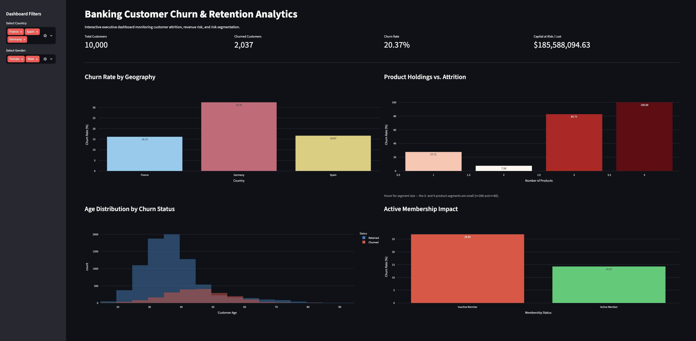

# Bank Customer Churn & Retention Analytics

[](https://banking-churn-analytics-vdqy4jkpjivkhkjg2g8bcg.streamlit.app)
[](https://www.python.org/downloads/)
[](LICENSE)

An end-to-end data analytics project investigating customer attrition across 10,000 retail banking accounts. This project identifies core churn drivers, quantifies at-risk deposit revenue, and delivers actionable retention strategies through SQL data pipelines, Python EDA, and an interactive Streamlit dashboard.

### 🔗 [**Launch the live dashboard →**](https://banking-churn-analytics-vdqy4jkpjivkhkjg2g8bcg.streamlit.app)



---

## Executive Summary & Key Insights
* **Revenue Exposure:** The bank experienced an overall **20.37% churn rate** (2,037 of 10,000 accounts lost), resulting in **$185.59M in lost deposit capital** (24.26% of total bank deposits).
* **Geographic Concentration:** **Germany** exhibits the highest churn rate at **32.44%** (n=2,509), roughly double France (16.15%, n=5,014) and Spain (16.67%, n=2,477), while simultaneously holding the highest average account balances ($119.7k/customer).
* **Pre-Retirement Capital Runoff:** Customers aged **46-60** represent the single highest churn bracket at **51.12%** (n=1,647), causing over **$75M** in deposit outflows.
* **Product Saturation Friction:** Clients with 3 or 4 products show churn rates of **82.71%** (n=266) and **100.00%** (n=60), pointing to friction in multi-product onboarding or fee structures. Note the small denominators. These two segments together are only 3.3% of the portfolio, so the effect is directionally strong but should be confirmed before acting on it.

### Analytical Caveats
* **36% of accounts (3,617) carry a zero balance.** This shapes the balance-based findings materially: Germany's higher average balance is partly an artifact of Germany having very few zero-balance accounts. "Capital at risk" figures are deposit balances at time of exit, not lifetime revenue.
* Churn is a **static label** in this dataset, with no timestamp, so all findings are cross-sectional associations, not causal or time-series effects.
* The 3- and 4-product segments are small (see above). Treat those churn rates as a signal to investigate, not as a stable estimate.

---

## Tech Stack
* **Cloud Data Warehouse & Querying:** Google BigQuery / SQL
* **Data Processing & EDA:** Python (`pandas`, `numpy`, `matplotlib`, `seaborn`)
* **Interactive Dashboarding:** Streamlit, Plotly Express
* **Environment Management:** macOS Zsh, `venv`

---

## Dataset

**Source:** [Bank Customer Churn Dataset](https://www.kaggle.com/datasets/gauravtopre/bank-customer-churn-dataset) by Gaurav Topre, via Kaggle.

The raw CSV is included at `data/raw/Bank Customer Churn Prediction.csv` for reproducibility (548 KB, 10,000 rows, 12 columns). Please refer to the Kaggle dataset page for its licensing terms. The dataset contains no real personally identifiable information.

| Column | Description |
|---|---|
| `customer_id` | Unique account identifier |
| `credit_score` | Customer credit score |
| `country` | France, Germany, or Spain |
| `gender` | Male / Female |
| `age` | Customer age (18-92) |
| `tenure` | Years as a customer |
| `balance` | Account balance (USD) |
| `products_number` | Number of bank products held (1-4) |
| `credit_card` | Holds a credit card (1/0) |
| `active_member` | Active membership status (1/0) |
| `estimated_salary` | Estimated annual salary (USD) |
| `churn` | Target: customer exited (1) or retained (0) |

**Data quality:** 0 missing values, 0 duplicate rows, 0 duplicate customer IDs.

---

## Project Structure
```text
banking-churn-analytics/
├── data/
│   └── raw/
│       └── Bank Customer Churn Prediction.csv  # Kaggle source data (10,000 rows)
├── sql/
│   └── banking_churn_analysis.sql              # BigQuery segmentation queries
├── notebooks/
│   ├── 01_banking_churn_eda.ipynb              # Exploratory analysis (outputs committed)
│   └── 02_kaggle_churn_analysis.ipynb          # Kaggle-published version (self-contained)
├── docs/
│   └── dashboard.png                           # Dashboard screenshot used in this README
├── app.py                                      # Interactive Streamlit dashboard
├── requirements.txt                            # Python dependencies
├── .gitignore                                  # Excludes venvs, checkpoints, .DS_Store
├── LICENSE                                     # MIT (code only; dataset per Kaggle)
└── README.md                                   # Portfolio case study documentation
```

---

## Setup & Usage

Requires Python 3.10 or newer.

```bash
git clone https://github.com/jithmak/banking-churn-analytics.git
cd banking-churn-analytics

python3 -m venv data_env
source data_env/bin/activate        # Windows: data_env\Scripts\activate

pip install -r requirements.txt
```

> **Important:** both the dashboard and the notebook resolve the dataset with the
> relative path `data/raw/...`, so **run every command from the repository root.**
> Launching `jupyter lab` from inside `notebooks/` will raise `FileNotFoundError`.

**Run the interactive dashboard** (opens at `http://localhost:8501`):

```bash
streamlit run app.py
```

**Open the exploratory analysis notebook:**

```bash
jupyter lab notebooks/01_banking_churn_eda.ipynb
```

A second notebook, `notebooks/02_kaggle_churn_analysis.ipynb`, is the version
published on Kaggle. It is self-contained and chart output is static PNG, and resolves
the dataset from either the Kaggle input mount or this repository, so it runs in
both places unchanged.

The notebook is committed with its outputs intact, so all charts and tables render directly on GitHub without needing to execute it.

**SQL queries:** `sql/banking_churn_analysis.sql` targets the BigQuery table
`banking-churn-project.banking_analytics.bank_churn`, which was loaded directly
from the CSV in `data/raw/`. To run the queries yourself, upload that CSV to your
own BigQuery dataset and replace the table reference. The queries are included as
artifacts of the warehouse layer of this project.

---

## Deployment

The dashboard is deployed on **Streamlit Community Cloud**, which builds directly
from this repository. The dataset is committed under `data/raw/`, so the app is
fully self-contained. No external database or credentials are required at runtime.

To deploy your own copy:

1. Push this repository to GitHub (it must be **public**, or you must grant
   Streamlit access to private repos).
2. Sign in at [share.streamlit.io](https://share.streamlit.io) with your GitHub account.
3. Click **New app** and select:
   - **Repository:** `jithmak/banking-churn-analytics`
   - **Branch:** `main`
   - **Main file path:** `app.py`
4. Deploy. Streamlit installs from `requirements.txt` automatically.

Every push to `main` redeploys the app.

---

## License

Code and documentation in this repository are released under the [MIT License](LICENSE). The dataset is the property of its original authors. See the Kaggle link above for its terms.
